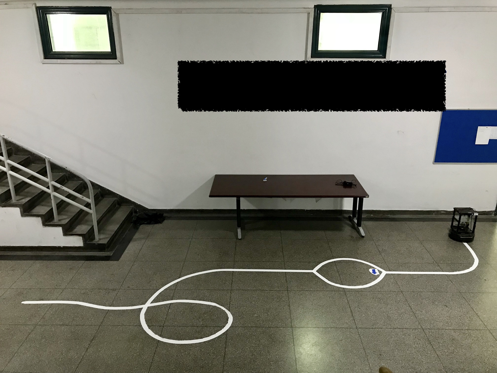

## Final Game of Operate Practice 2018 Spring
### 1.Rule
Programming with ros let turtlebot run on the line automaticlly. 
When met with a cross, it should choose the driection the arrow points. The color of arrow could be blue, green, red or yellow.
You are allowed to touch the turtlebot twice.
The ground is shown by the picture below.

### ECNU CSSE 2015 Prilo
